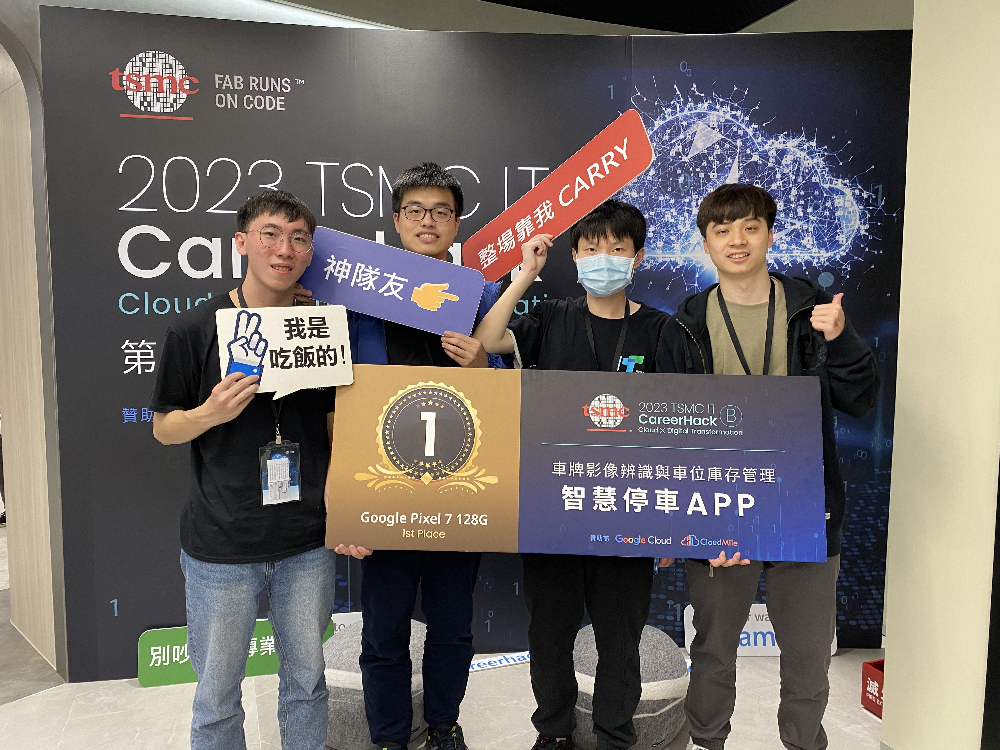

# 2023-TSMC-IT-CareerHack
2023 TSMC IT CareerHack  智慧停車 APP 車牌影像辨識與車位庫存管理 - 冠軍

本專案旨在解決大型企業辦公區域停車管理的問題。由於企業辦公區域通常有大量的員工停車需求，如何有效分配停車位並加以妥善管理是一個挑戰。

我們的設計理念有以下幾點：

1. 客戶端 APP 部分我們提供導覽、找車服務、預約系統等服務。

2. 警勤管理系統部分我們提供停車場現況、違停統計圖、停車紀錄等服務。

3. 在前端設計上，使用者可以在最短時間內獲得想要的資訊，並且一目了然，讓使用者不必與其他資訊來源反覆交叉比對。

4.  為了便於在短時間內開發，我們的行動裝置用 App 與警勤管理介面採用 Web 網頁開發，以便共同編輯樣式。

5. 在資料庫方面，我們希望不要產生過多的冗餘表格，若查詢語句可以獲取資料，就不為其額外建表。

透過以上理念設計出資料庫、Web、App後，再加上車牌辨識模型，最終在比賽中**榮獲冠軍(初賽約500人)**
